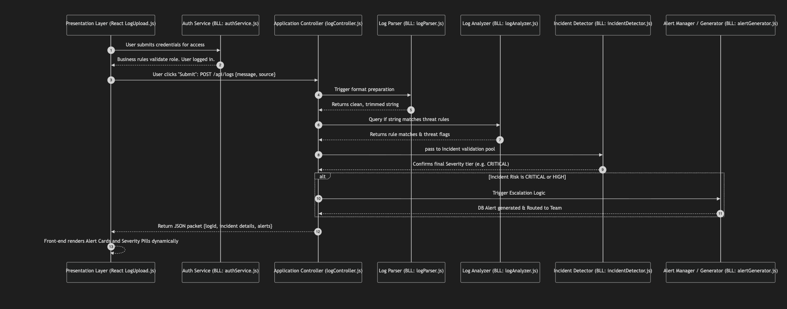

# Software Engineering Lab Assignment: ALARS Architecture Analysis

## Q1. Core Functional Modules Related to the Business Logic Layer (BLL)

In a typical software architecture, the Business Logic Layer (BLL) serves as the mediator between the Presentation Layer (UI) and the Data Access Layer (Database). It contains the core intelligence, algorithms, domain constraints, and behavioral rules required to fulfill the specific use cases of the application. 

In the **ALARS (Automated Log Analysis & Incident Response System)** project, the BLL is carefully decoupled into microservice-oriented modules located in the `Backend/services/` directory. Each service represents a distinct cognitive step in processing a system anomaly:

### 1. Functional Modules Identified and Implemented:
1. **`logParser.js` (Data Normalization Service)**: 
   * **Functionality**: Serves as the first frontier of the BLL, scrubbing incoming logs. It removes whitespace padding and enforces formatting baselines before deeper algorithmic inspection begins.
2. **`logAnalyzer.js` (Keyword Search and Rules Engine)**: 
   * **Functionality**: Houses the specific domain knowledge of what constitutes a "suspect" log. It uses dictionary-based rule evaluation against an internal array (e.g., `CRITICAL`, `ERROR`, `FAIL`) to determine if a generic log has crossed the threshold into becoming a potential system incident.
3. **`riskClassifier.js` (Severity Matrix Service)**: 
   * **Functionality**: Contains the strict hierarchical business rules that correlate a detected keyword to an actionable operational risk level (`CRITICAL`, `HIGH`, `MEDIUM`, or `LOW`). 
4. **`incidentDetector.js` (Decision Orchestrator)**: 
   * **Functionality**: Acts as the authoritative arbitrator. It invokes the Analyzer and the Classifier in sequence and builds the final domain object that declares an event as a "Confirmed Incident" with an attached risk profile. 
5. **`alertGenerator.js` & `alertManager.js` (Escalation & Routing Logic)**: 
   * **Functionality**: Defines who gets notified and how. Includes mapping logic (e.g., Priority Map `1 to 4`) and enforces routing rules (Critical incidents immediately page the `ADMIN` and `SECURITY TEAM`, while lower severities page the `ANALYST`).
6. **`authService.js` (Access Control Logic)**: 
   * **Functionality**: Manages user login attempts, account locking policies (e.g., lock after 3 failed attempts), and role-based permissions preventing unauthorized actions.

---

### Interaction with the Presentation Layer (Pictorial Representation)

The interaction between the React-based User Interface (Presentation Layer) and the Node.js Express Backend BLL is structured around stateless HTTP Request/Response cycles mediated by the `logController.js`. 

The components communicate predictably and safely: the UI creates the request, the BLL performs multi-step analysis, and the UI dynamically manipulates DOM state based on the processed BLL outcome.

Below is the **sequence diagram** mapping exactly how the UI interacts continuously with these core functional BLL modules:



---

## Q2. Software Engineering Project Descriptions

### A) Implementation of Business Rules
Business rules define the constraints and behaviors unique to the business domain of an application. In ALARS, the rules map diagnostic events to required human actions. We have isolated these rules into pure JavaScript functions rather than hard-coding them into route handlers, demonstrating high cohesion and low coupling.

* **Account Protection Rules**: (`authService.js`)
  * The system implements a strict lockout mechanism. The business rule states: *"A user is permitted a maximum of 3 failed authentication attempts. On the 4th, the account flag is locked."* This rule is maintained via internal state tracking isolated strictly inside the BLL.
* **Risk Prioritization Rules**: (`riskClassifier.js`)
  * When multiple triggering keywords exist in a log, which severity wins? The system implements a **cascading priority hierarchy**. It checks `CRITICAL` > `ERROR` > `FAIL` > `WARNING` in vertical order, ensuring the highest risk dynamically overrides lower-tier risks.
* **Alert Escalation Rules**: (`alertManager.js`)
  * Not all incidents require pager notifications, which causes alert fatigue. The operational business rule states that only specific severity classifications (CRITICAL or HIGH) trigger escalation routing to the `SECURITY TEAM`. Minor incidents are merely logged quietly to the Database.

### B) Validation Logic
Data entering any backend system natively carries a risk of being malformed, malicious, or incompatible with the database schema. **Validation logic** is a "fail-fast" barrier utilized to prove data structure correctness.

In our project, we have indeed implemented strict Validation Logic inside the Express route controllers (`logController.js` and `incident_module.js`). 
* **Null Check and Empty Submission Guard**:
  ```javascript
  if (!message || !message.trim()) {
    return res.status(400).json({ error: 'Log message is required.' });
  }
  ```
* **Explanation**: Before engaging the heavy computations of the BLL or writing to the Persistence Layer, the system strictly verifies if the payload text is present and if it contains readable characters. If an empty string or whitespace-only buffer is provided, the API halts execution locally and immediately returns an HTTP 400 Bad Request exception. This validation strategy prevents "Undefined errors" from cascading into the microservices.

### C) Proper Data Transformation
Data Transformation acts as an ETL (Extract, Transform, Load) bridge, changing the literal structural format of an incoming value into an anticipated canonical configuration seamlessly. 

In ALARS, users might write logs locally using varied command line tools that append extra spaces, invisible characters, or trailing new lines. We have implemented a data transformation routine explicitly inside `logParser.js`:

```javascript
// Transformation Pipeline Function
function parseLog(rawMessage, source = 'manual') {
  const cleaned = rawMessage.trim().replace(/\s+/g, ' ');

  return {
    message: cleaned,
    source:  source || 'manual',
  };
}
```
* **Process Explanation**: 
  1. **Sanitization**: Standard String methods (`trim()`) strip padding.
  2. **Regex Compression**: A Regular Expression `\s+` targets clusters of contiguous whitespace generated by broken console outputs, condensing them into a single, clean space character.
  3. **Object Reconstruction**: It maps unprovided inputs automatically to fallback identifiers (if a UI form doesn't send a source label, it transforms it implicitly to the `'manual'` label). 

By guaranteeing transformed, homogeneous text strings at the very entry gate, downstream SQL queries, string pattern-matching, and UI tabular rendering all execute fluidly without displaying layout-breaking spacing artifacts.
