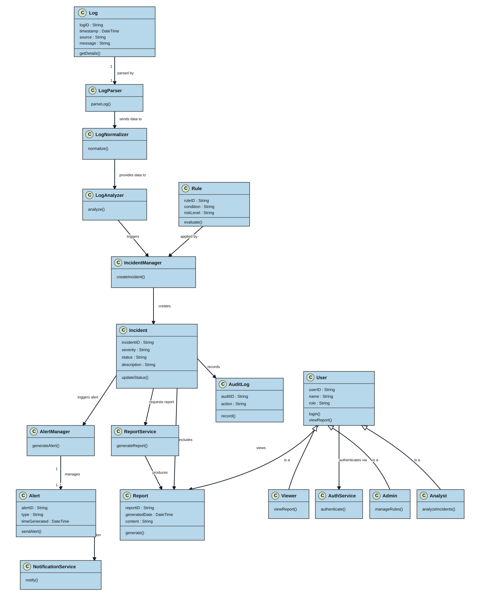
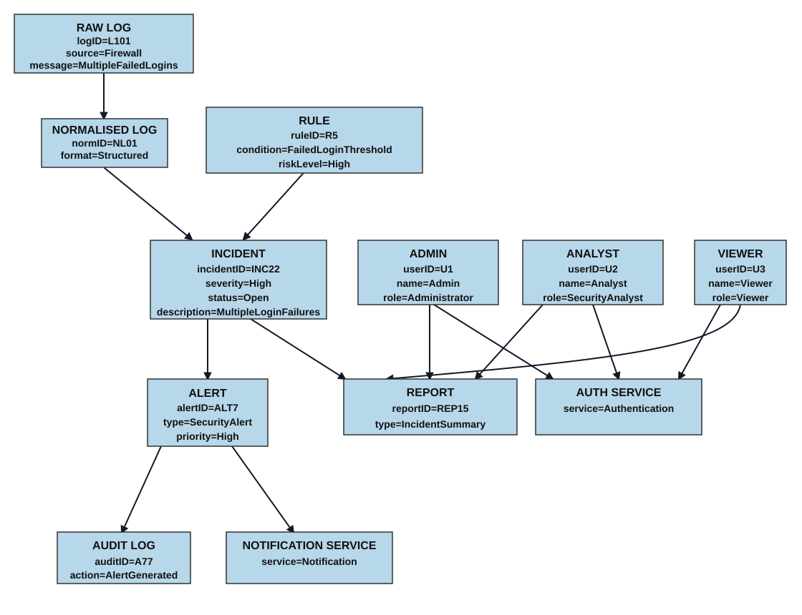

# Class and Object Diagram Overview - ALARS

This document summarizes the class and object diagrams for the Automated Log Analysis and Incident Response System (ALARS). The diagrams in this folder are stored as SVG so they render directly in GitHub.

## 1. Class Diagram

The class diagram shows the static structure of ALARS and the main relationships between processing, incident management, reporting, and user-access components.

### Main classes shown

- `Log`, `LogParser`, `LogNormalizer`, and `LogAnalyzer` model the log-processing pipeline.
- `Rule` and `IncidentManager` drive incident creation.
- `Incident`, `AlertManager`, `Alert`, `ReportService`, `Report`, and `AuditLog` capture the response workflow.
- `User` is specialized into `Admin`, `Analyst`, and `Viewer`.
- `AuthService` and `NotificationService` support authentication and alert delivery.

### Main relationships shown

- Logs are parsed, normalized, and analyzed before incidents are created.
- Rules are applied during incident creation.
- Incidents can trigger alerts, produce reports, and record audit events.
- Users view reports and authenticate through `AuthService`.
- `Admin`, `Analyst`, and `Viewer` inherit from `User`.

## 2. Object Diagram

The object diagram shows one concrete runtime snapshot of the same design. It uses sample instances to demonstrate how data and actors move through the ALARS workflow.

### Objects shown in the snapshot

- `RAW LOG`, `NORMALISED LOG`, and `RULE` represent one log-processing example.
- `INCIDENT` and `ALERT` show the detected security event and generated alert.
- `ADMIN`, `ANALYST`, and `VIEWER` represent the main system roles.
- `REPORT`, `AUTH SERVICE`, `AUDIT LOG`, and `NOTIFICATION SERVICE` show the supporting services and outputs.

### What the snapshot illustrates

- A raw firewall log is normalized and evaluated against a rule.
- The resulting incident creates an alert and a report.
- Users interact with reporting and authentication services.
- Alert generation is recorded in the audit log and forwarded to the notification service.

## 3. Summary

Together, these diagrams show both the ALARS design blueprint and a concrete runtime example. They complement the DFD documentation by linking system structure to system behavior.
