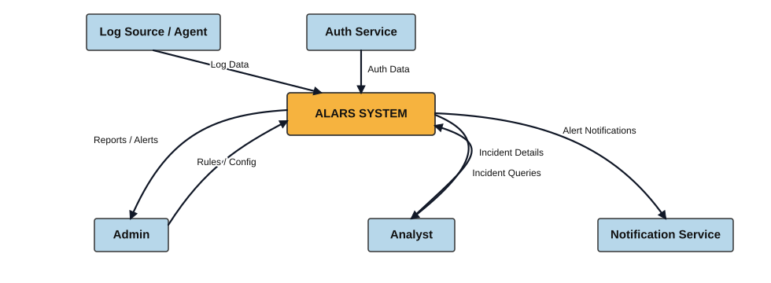
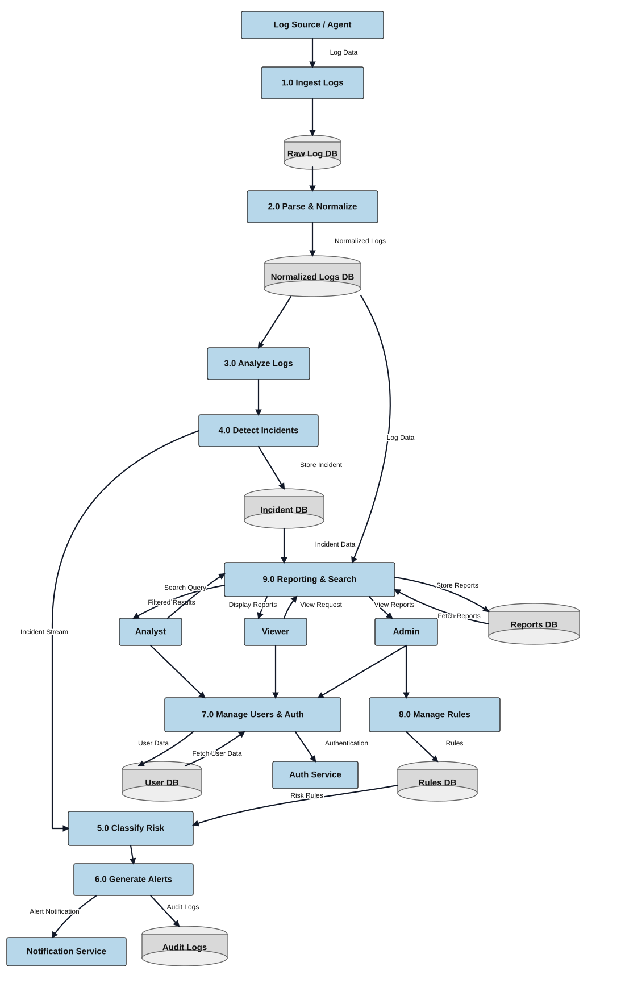

# DFD Overview - ALARS

This document summarizes the Level 0 and Level 1 data flow diagrams for the Automated Log Analysis and Incident Response System (ALARS). The diagrams in this folder are provided as SVG so they render directly in GitHub.

## 1. Purpose

The DFDs describe how ALARS moves data through its major processes, who interacts with the system, and where information is stored.

## 2. Level 0 DFD

The Level 0 diagram is the context view of ALARS. It treats the platform as a single system and shows the main external entities around it.

### External entities shown

- `Log Source / Agent`
- `Auth Service`
- `Admin`
- `Analyst`
- `Notification Service`

### Main flows shown

- Log data enters ALARS from log sources.
- Authentication data enters from the auth service.
- Admins send rules and configuration to the system and receive reports or alerts.
- Analysts submit incident queries and receive incident details.
- ALARS sends alert notifications to the notification service.

## 3. Level 1 DFD

The Level 1 diagram expands the internal processing pipeline and supporting services of ALARS.

### Internal processes shown

- `1.0 Ingest Logs`
- `2.0 Parse & Normalize`
- `3.0 Analyze Logs`
- `4.0 Detect Incidents`
- `5.0 Classify Risk`
- `6.0 Generate Alerts`
- `7.0 Manage Users & Auth`
- `8.0 Manage Rules`
- `9.0 Reporting & Search`

### Data stores shown

- `Raw Log DB`
- `Normalized Logs DB`
- `Incident DB`
- `User DB`
- `Rules DB`
- `Reports DB`
- `Audit Logs`

### Main interactions shown

- Logs move from ingestion through parsing, analysis, incident detection, and risk classification.
- Incidents are stored and later exposed through reporting and search.
- Alerts are sent to the notification service and recorded in audit logs.
- Admin, analyst, and viewer roles interact with reporting and user/authentication management.
- Rules and user data are managed through dedicated internal stores and services.

## 4. Summary

The Level 0 DFD shows the ALARS system boundary. The Level 1 DFD shows the internal workflow that supports detection, reporting, access control, and alerting.
