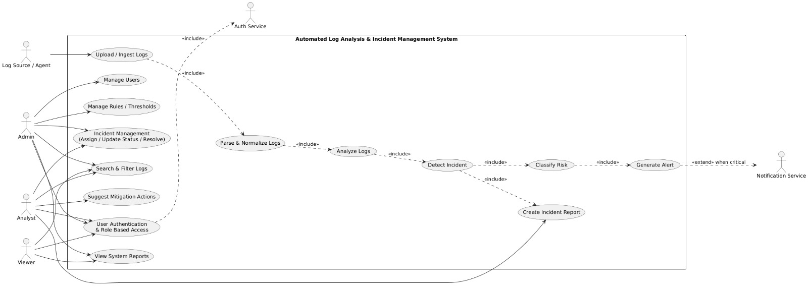
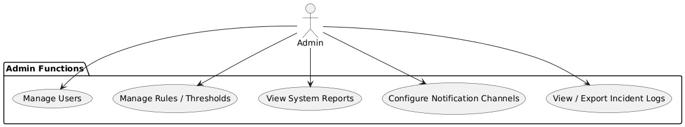
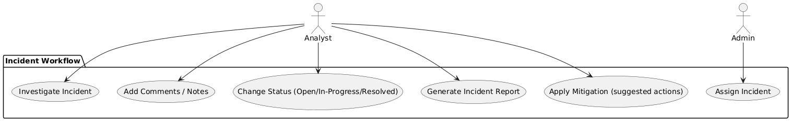

# UML Documentation – Automated Log Analysis & Incident Management System (ALARS)

---

## 1. Overview

This document explains the UML Use Case diagrams for the **Automated Log Analysis & Incident Management System (ALARS)**.

These diagrams represent:
- System actors
- Functional workflows
- Role-based operations
- Incident lifecycle
- External service integrations

---

## 2. Main System Use Case Diagram

### Purpose
This diagram represents the overall working of the ALARS system, showing interactions between users, external services, and core system modules.

---

### Actors

#### Log Source / Agent
- Uploads system logs to ALARS
- Provides raw log data for analysis

#### Admin
- Manages system users
- Configures rules and thresholds
- Assigns incidents
- Views reports and logs

#### Analyst
- Investigates detected incidents
- Updates incident status
- Applies mitigation actions
- Generates reports

#### Viewer
- Views dashboards and reports
- Read-only system access

#### External Services
- **Authentication Service** → Handles login and identity verification  
- **Notification Service** → Sends alerts when critical incidents occur  

---

### Core Processing Workflow

1. Upload / Ingest Logs  
2. Parse & Normalize Logs  
3. Analyze Logs  
4. Detect Incident  
5. Classify Risk  
6. Generate Alert  
7. Create Incident Report  

If risk is **critical**, notification service is triggered automatically.

---

## 3. Admin Functional Use Cases

### Admin Capabilities

- Manage Users  
- Manage Rules & Thresholds  
- View System Reports  
- Configure Notification Channels  
- View / Export Incident Logs  

Admin controls system configuration and monitoring.

---

## 4. Incident Workflow Use Cases

### Analyst Responsibilities

- Investigate Incidents  
- Add Comments / Notes  
- Change Incident Status  
  - Open  
  - In Progress  
  - Resolved  
- Generate Incident Reports  
- Apply Mitigation Actions  

---

### Admin Incident Role

- Assign incidents to analysts
- Monitor resolution progress

---

## 5. Security Model

The system implements:

### Authentication
- Secure login validation

### Authorization (RBAC – Role Based Access Control)
Roles include:
- Admin
- Analyst
- Viewer

Each role has controlled permissions.

---

## 6. Key System Features Represented

- Automated Log Processing  
- Real-time Incident Detection  
- Risk Classification Engine  
- Alert Generation System  
- Incident Reporting  
- Suggested Mitigation Actions  

---

## 7. System Benefits

- Faster incident detection  
- Reduced manual monitoring  
- Structured incident handling workflow  
- Improved system security monitoring  

---

## 8. Conclusion

The UML diagrams define the full ALARS workflow from log ingestion to incident resolution.  
They also define system roles, responsibilities, and external integrations.

These diagrams serve as a blueprint for system design and implementation.

---