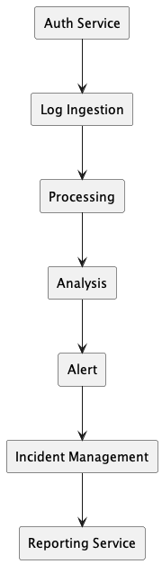
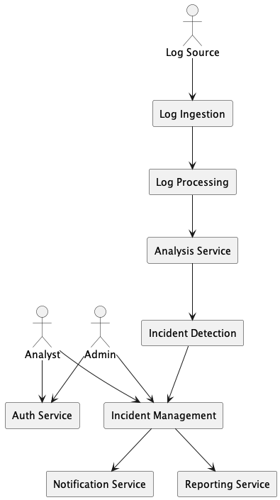

# Assignment 4 — ALARS (Automated Log Analysis & Incident Response System)

---

## I) Software Architecture Style

### Chosen Style: Microservices Architecture

- ALARS is designed using microservices where each service performs one specific task in the log analysis pipeline.
- Services are loosely coupled and communicate via lightweight APIs, so changes in one service do not heavily impact others.
- This style is suitable for real-time log processing and incident response where different functions (ingestion, analysis, alerts) must run continuously and independently.

---

### A) Justification (Granularity)

- System is divided into small independent services based on functionality.
- Each service has a single responsibility such as ingestion, processing, or reporting.
- Services can be deployed and scaled separately depending on system load.
- Smaller services make maintenance, testing, and updates easier.
- Teams can work on different services in parallel.

#### Main Services

- **Auth Service**
  - Handles login and role-based access.

- **Log Ingestion**
  - Collects logs from sources.

- **Log Processing**
  - Parses and normalizes logs.

- **Analysis Service**
  - Detects anomalies in logs.

- **Alert / Incident Detection**
  - Identifies and flags incidents.

- **Incident Management**
  - Assigns and resolves incidents.

- **Reporting Service**
  - Generates reports and summaries.

---

### Service Flow Diagram

---

### B) Why Microservices is Best

- **Scalability**
  - High-load services like analysis can be scaled without scaling the whole system.

- **Maintainability**
  - Small services are easier to understand, update, and debug.

- **Performance**
  - Multiple services can process logs in parallel, improving speed.

- **Reliability**
  - Failure of one service (e.g., reporting) does not stop ingestion or analysis.

- **Flexibility**
  - New rules, detection logic, or features can be added to specific services.

---

## II) Application Components

### Components Present

- **Log Source / Agent**
  - Generates logs from servers, applications, or devices and sends them to the system.

- **Auth Service**
  - Authenticates users and enforces role-based access for Admin and Analyst.

- **Log Ingestion**
  - Receives logs from multiple sources and forwards them for processing.

- **Log Processing**
  - Parses, filters, and normalizes raw logs into a structured format.

- **Analysis Service**
  - Examines processed logs to find anomalies or suspicious patterns.

- **Incident Detection**
  - Determines whether an anomaly is an actual incident and assigns severity.

- **Incident Management**
  - Creates, assigns, tracks, and resolves incidents.

- **Notification Service**
  - Sends alerts or messages when critical incidents occur.

- **Reporting Service**
  - Generates reports and summaries for monitoring and decision-making.

- **Admin and Analyst Users**
  - Admin configures rules and manages the system.
  - Analyst investigates and resolves incidents.

---

### Component Interaction Diagram

---

## Conclusion

- Microservices architecture makes ALARS scalable and modular.
- Suitable for real-time monitoring systems.
- Easy to maintain and extend.