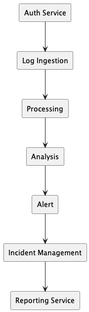
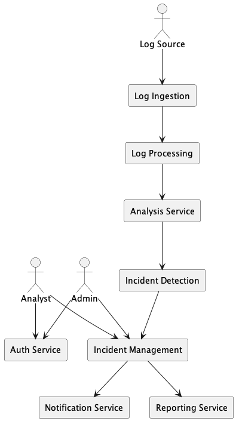

# Assignment 4 — ALARS (Automated Log Analysis & Incident Response System)

---

## I) Software Architecture Style

### Chosen Style: Microservices Architecture

- ALARS is designed using microservices where each service performs one specific task in the log analysis pipeline.
- Services are loosely coupled and communicate via lightweight APIs, so changes in one service do not heavily impact others.
- This style is suitable for real-time log processing and incident response where different functions (ingestion, analysis, alerts) must run continuously and independently.

---

### A) Justification (Granularity)

- System is divided into small independent services based on functionality.
- Each service has a single responsibility such as ingestion, processing, or reporting.
- Services can be deployed and scaled separately depending on system load.
- Smaller services make maintenance, testing, and updates easier.
- Teams can work on different services in parallel.

#### Main Services

- **Auth Service**
  - Handles login and role-based access.

- **Log Ingestion**
  - Collects logs from sources.

- **Log Processing**
  - Parses and normalizes logs.

- **Analysis Service**
  - Detects anomalies in logs.

- **Alert / Incident Detection**
  - Identifies and flags incidents.

- **Incident Management**
  - Assigns and resolves incidents.

- **Reporting Service**
  - Generates reports and summaries.

---

### Service Flow Diagram



---

### B) Why Microservices is Best

- **Scalability**
  - High-load services like analysis can be scaled without scaling the whole system.

- **Maintainability**
  - Small services are easier to understand, update, and debug.

- **Performance**
  - Multiple services can process logs in parallel, improving speed.

- **Reliability**
  - Failure of one service (e.g., reporting) does not stop ingestion or analysis.

- **Flexibility**
  - New rules, detection logic, or features can be added to specific services.

---

## II) Application Components

### Components Present

- **Log Source / Agent**
  - Generates logs from servers, applications, or devices and sends them to the system.

- **Auth Service**
  - Authenticates users and enforces role-based access for Admin and Analyst.

- **Log Ingestion**
  - Receives logs from multiple sources and forwards them for processing.

- **Log Processing**
  - Parses, filters, and normalizes raw logs into a structured format.

- **Analysis Service**
  - Examines processed logs to find anomalies or suspicious patterns.

- **Incident Detection**
  - Determines whether an anomaly is an actual incident and assigns severity.

- **Incident Management**
  - Creates, assigns, tracks, and resolves incidents.

- **Notification Service**
  - Sends alerts or messages when critical incidents occur.

- **Reporting Service**
  - Generates reports and summaries for monitoring and decision-making.

- **Admin and Analyst Users**
  - Admin configures rules and manages the system.
  - Analyst investigates and resolves incidents.

---

### Component Interaction Diagram



---

## III) API Route Documentation

### Base URL

During local development, the backend API runs at:

```text
http://127.0.0.1:5000
```

All application API routes are mounted under `/api`.

---

### Authentication

Some routes require a JSON Web Token (JWT). After a successful login, the client should send the token in the `Authorization` header:

```http
Authorization: Bearer <token>
```

If the token is missing or invalid, protected routes return `401 Unauthorized`.

---

### Route Summary

| Method | Route | Auth Required | Purpose |
|--------|-------|---------------|---------|
| GET | `/` | No | Health check for the backend API |
| POST | `/api/auth/register` | No | Create a new user account |
| POST | `/api/auth/login` | No | Log in and receive a JWT |
| POST | `/api/logs` | No | Submit a log message for parsing and incident detection |
| GET | `/api/logs` | No | Retrieve all stored logs |
| GET | `/api/incidents` | Yes | Retrieve all detected incidents |

---

### GET `/`

Checks whether the backend server is running.

**Success response**

```json
{
  "message": "ALARS API is running",
  "version": "1.0.0"
}
```

---

### POST `/api/auth/register`

Creates a new user account.

**Request body**

```json
{
  "username": "analyst",
  "password": "password123",
  "role": "user"
}
```

**Success response**

```json
{
  "id": 1,
  "username": "analyst",
  "role": "user"
}
```

**Common error responses**

| Status | Reason |
|--------|--------|
| 400 | Username or password is missing |
| 409 | User already exists |
| 500 | Internal server error |

---

### POST `/api/auth/login`

Authenticates a user and returns a JWT for protected routes.

**Request body**

```json
{
  "username": "analyst",
  "password": "password123"
}
```

**Success response**

```json
{
  "token": "<jwt-token>",
  "user": {
    "id": 1,
    "username": "analyst",
    "role": "user"
  }
}
```

**Common error responses**

| Status | Reason |
|--------|--------|
| 400 | Username or password is missing |
| 401 | Invalid credentials |
| 500 | Internal server error |

---

### POST `/api/logs`

Submits a raw log message. The backend trims and normalizes the message, stores it, checks whether an incident is required, and creates an alert only for critical incidents.

**Request body**

```json
{
  "message": "CRITICAL: Disk failure on server-01",
  "source": "storage-monitor"
}
```

**Success response**

```json
{
  "success": true,
  "log": {
    "id": 1,
    "message": "CRITICAL: Disk failure on server-01",
    "source": "storage-monitor"
  },
  "incident": {
    "id": 1,
    "riskLevel": "CRITICAL"
  },
  "alert": {
    "alertId": 1,
    "alertMessage": "CRITICAL ALERT: Incident #1 requires immediate attention. Log: \"CRITICAL: Disk failure on server-01\""
  }
}
```

If no incident is required, `incident` and `alert` are returned as `null`.

**Common error responses**

| Status | Reason |
|--------|--------|
| 400 | Log message is missing or blank |
| 500 | Internal server error |

---

### GET `/api/logs`

Returns all stored logs in descending timestamp order.

**Success response**

```json
[
  {
    "id": 1,
    "message": "CRITICAL: Disk failure on server-01",
    "source": "storage-monitor",
    "timestamp": "2026-04-12T10:30:00.000Z"
  }
]
```

---

### GET `/api/incidents`

Returns all incident records with their related log message and source. This route requires a valid JWT.

**Headers**

```http
Authorization: Bearer <token>
```

**Success response**

```json
[
  {
    "id": 1,
    "log_id": 1,
    "risk_level": "CRITICAL",
    "status": "open",
    "created_at": "2026-04-12T10:30:00.000Z",
    "log_message": "CRITICAL: Disk failure on server-01",
    "source": "storage-monitor"
  }
]
```

**Common error responses**

| Status | Reason |
|--------|--------|
| 401 | Missing or invalid token |
| 500 | Internal server error |

---

## Conclusion

- Microservices architecture makes ALARS scalable and modular.
- Suitable for real-time monitoring systems.
- Easy to maintain and extend.
