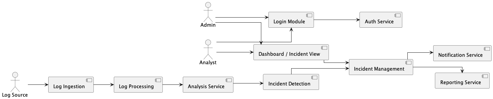

## 2️⃣ User and Component Interaction – ALARS

---

## 🔹 1️⃣ How End Users Access ALARS

### 👤 Actors

- **Admin**
- **Analyst**
- **Viewer (User)**

---

## 🔹 System Access Flow (Step-by-Step)

### 🔸 Step 1: User Access

- Admin / Analyst / Viewer opens the web application in a browser.
- User enters login credentials.
- Login request is sent to **Auth Service**.

---

### 🔸 Step 2: Authentication & Authorization

- Auth Service validates user credentials.
- If authentication is successful → access is granted.
- Role-based permissions are applied:

  - **Admin**
    - Manage incidents
    - Manage rules
    - View and generate reports

  - **Analyst**
    - Analyze incidents
    - Update incident status
    - View reports

  - **Viewer**
    - View reports only

---

### 🔸 Step 3: Log Processing Flow (Backend)

1. **Log Source** sends logs to:
   → **Log Ingestion**

2. Logs move to:
   → **Log Processing**  
   (Parsing & Normalization)

3. Processed logs move to:
   → **Analysis Service**  
   (Rule matching & risk classification)

4. If suspicious activity is detected:
   → **Incident Detection**

---

### 🔸 Step 4: Incident Handling

- Incident Detection forwards confirmed incidents to:
  → **Incident Management**

Incident Management performs:

- Incident storage
- Status tracking (Open → Acknowledged → Resolved)
- Allows Admin/Analyst to update incidents
- Triggers:

  - ✔ **Notification Service** (for critical incidents)
  - ✔ **Reporting Service**

---

### 🔸 Step 5: Reporting & Notifications

- **Notification Service** sends alerts to relevant stakeholders.
- **Reporting Service** generates incident reports.
- Admin / Analyst / Viewer access reports via the dashboard UI.

---

## 2️⃣ Pictorial Representation

---